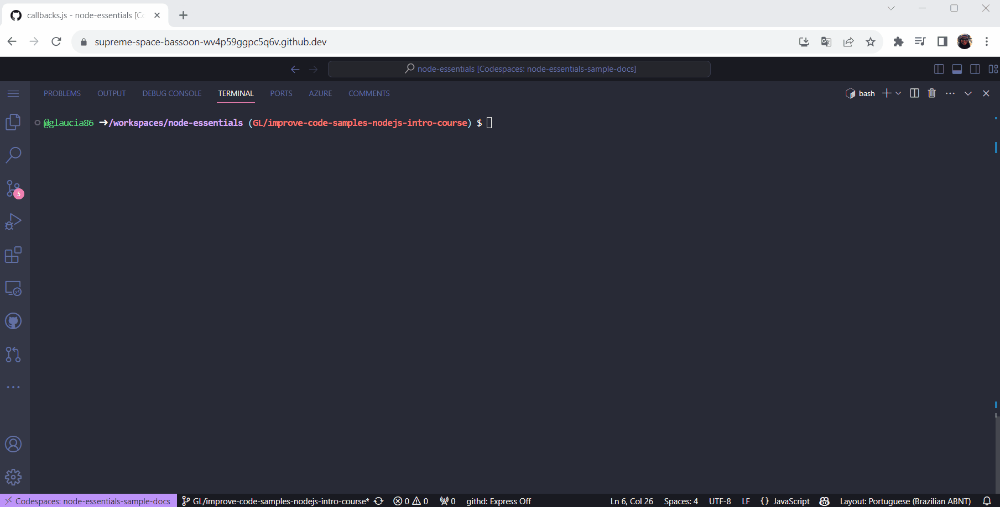

# Repository for the Course: Introduction to Node.js

Repository responsible for the code developed during the **[Introduction to Node.js course](https://learn.microsoft.com/training/modules/intro-to-nodejs/?WT.mc_id=javascript-111027-gllemos)** from Microsoft Learn.

## How to run the code?

1. First fork the repository and then clone it.

2. You can use Codespaces to run the code directly in the browser, or you can clone the repository and run it locally.

3. Go to the folder: `nodejs-intro/3-how-nodejs-works`. And for example, run the following command:

```bash
node callback.js
```



## Any issues or doubts?

If you have any problems or doubts related to the code, feel free to open an **[issue](https://github.com/MicrosoftDocs/node-essentials/issues)** indicating the problem or doubt.